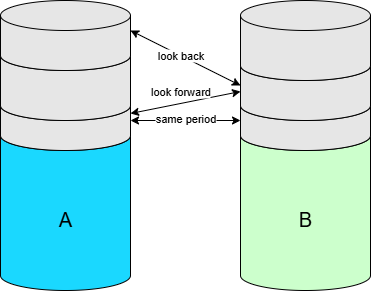

# Summary

This library implements the incremental join function that helps you to join 2 very large tables that are incrementally refreshed. Benefits of using this library:
- Performance: This is achieved by selecting the smallest scope possible during joining. 
- Efficiency: Users do not have to worry about the complexity of incremental join. 
- Maintainability: The complexity of incremental join is removed from your code and thus it makes your code more readable and easier to maintain.  
- Consistency: The outcome of the join is not dependent on the size of the join interval (e.g. daily, monthly, yearly).

For a detailed description of how this join works, please continue reading. 

- [Summary](#summary)
- [Incremental refresh](#incremental-refresh)
- [Example data](#example-data)
- [Joining incrementally refreshed tables](#joining-incrementally-refreshed-tables)
- [Implementation](#implementation)
  - [Join scenarios](#join-scenarios)
    - [Same period](#same-period)
    - [A is late](#a-is-late)
    - [B is late](#b-is-late)
    - [Incremental join of A and B is outdated](#incremental-join-of-a-and-b-is-outdated)
  - [Implementation using SQL](#implementation-using-sql)
  - [Target increment timestamp](#target-increment-timestamp)
- [Conclusion](#conclusion)
- [Installation](#installation)
- [Usage](#usage)
- [Contributing](#contributing)
- [License](#license)

# Incremental refresh

Suppose you have two big data tables (e.g. Delta tables). Because the tables are so big, they are incrementally refreshed. This means that every day we add or change only the new data and mark this with e.g. a unique timestamp. Using this timestamp, downstream applications can pick up these changes and there is no need for an expensive full table refresh. This paper will explain how we can also use this timestamp for efficient joining.



# Example data

To explain this incremental join we introduce the following example datasets:

- A: Bank Transactions from the financial system  
- B: Bank Transactions from the SEPA payment engine.

Note that both tables are huge (multiple terabytes) and both tables contain facts that do not change, so we only need to add new data (or facts) to A and B and we don't need to update any historic data.

# Joining incrementally refreshed tables

Suppose we want to join A with B and because both A and B are big we want to limit the scope of this join to the smallest possible dataset. The issue is however that **we don't know exactly which increment contains the matching records** in B. This is requirement 1.

- _Requirement 1._ Join A with B where B is filtered to the smallest scope possible in order to get the best performance.

A second requirement is that we want to have a waiting mechanism for records that do not match, because the matching record in B can still arrive in the future.

- _Requirement 2._ Wait for unmatched records for a certain amount of time (called the look forward period).

However we should not wait forever, because we do not want to postpone the delivery of these unmatched records from A to the consumer.

- _Requirement 3._ If after this look forward period the match between A and B can still not be made we call this join outdated. Outdated records from A will be delivered to the consumer. However they will not be joined with B.

The final requirement is that no matter how we process this join (e.g. per day, month or year), the outcome should always be the same — in other words: the history of the joined data should never change. This last requirement is important when you use this data e.g. for machine learning and you don't want to have to deal with changing data.

- _Requirement 4._ The result of A incremental join B should always stay the same, even if you reprocess this join using a larger interval (e.g. month or year). 

This requirement is relevant when you reprocess the join for old data that was previously processed on a daily basis. For example, if you reprocess the year 2023 all at once and B contains all records of 2023, this might give a better join, but because of requirement 4 we will join as good as we did when it was daily processed. The con of this requirement is that you don't benefit from a better match percentage when you join on a larger interval. The pro is that your machine learning models will behave the same because the data has not changed.

# Implementation

## Join scenarios

### Same period

A and B are processed in the same increment, or on the same day (assuming that an increment is a day). This is the happy flow and for most records this is usually the case.

### A is late

A is in a newer increment than B. For example on March 6 we receive a record in A that we are expected to join with B, but the matching record in B was already present in the increment of March 2.

**Look back period** specifies the number of increments that we look back when trying to join A and B (e.g. 6 days).

### B is late

When we process A on March 6, B is not present yet. Only on March 10 the matching record in B is delivered.

**Look forward period** specifies the number of increments that we look forward when trying to match A and B (e.g. 10 days).

### Incremental join of A and B is outdated

After the lookback and lookforward we still cannot match A and B. For example: if we still did not find a match on March 16, then we send A unmatched to the output (because A was received on March 6 and the look forward period is 10 days).

## Implementation using SQL

```sql
-- A LEFT JOIN B where:
(
  -- same day
  (
    A._ProcessDate >= ProcessPeriodStart
    AND A._ProcessDate <= ProcessPeriodEnd
  )
  AND
  ( A._ProcessDate = B._ProcessDate )
)
OR
(
  -- A is late (for max look_back_days days) or same day
  (
    A._ProcessDate >= ProcessPeriodStart
    AND A._ProcessDate <= ProcessPeriodEnd
  )
  AND
  (
    B._ProcessDate >= date_add(A._ProcessDate, -look_back_days)
    AND B._ProcessDate < A._ProcessDate
  )
)
OR
(
  -- B is late
  (
    B._ProcessDate >= ProcessPeriodStart
    AND B._ProcessDate <= ProcessPeriodEnd
  )
  AND
  (
    A._ProcessDate >= date_add(B._ProcessDate, -look_forward_days)
    AND A._ProcessDate < B._ProcessDate
  )
)
OR
(
  -- A is outdated (unable to match with B)
  A._ProcessDate >= ProcessPeriodStart - look_forward_days
  AND A._ProcessDate <= ProcessPeriodEnd - look_forward_days
  AND B._ProcessDate IS NULL -- no match in all period
)
```

## Target increment timestamp

Note that we identify each increment with a unique and sequential timestamp. When we join A with B we should define the target timestamp for the joined data.

**Target timestamp for A incremental join B:** Max timestamp from A and B or outdated timestamp.

# Conclusion

We described a way of joining very large incrementally refreshed tables, focused on performance and consistency. We moved this logic into a Python function in Databricks. The big advantage is that you remove complexity from your code, so your code becomes more readable. It will only contain the things that are specific for the datasets that you are joining, e.g. join condition, look back and look forward intervals and aliases for the datasets so that you will not get duplicated columns.

# Installation

To install My Python Library, you can use pip:

```
pip install my-python-library
```

# Usage

Here is a simple example of how to use My Python Library:

```python
from my_python_library import some_function

result = some_function()
print(result)
```

# Contributing

Contributions are welcome! Please read the [CONTRIBUTING.md](CONTRIBUTING.md) for guidelines on how to contribute to this project.

# License

This project is licensed under the GNU Lesser General Public License v3 or later (LGPLv3+) License - see the [LICENSE](LICENSE) file for details.
