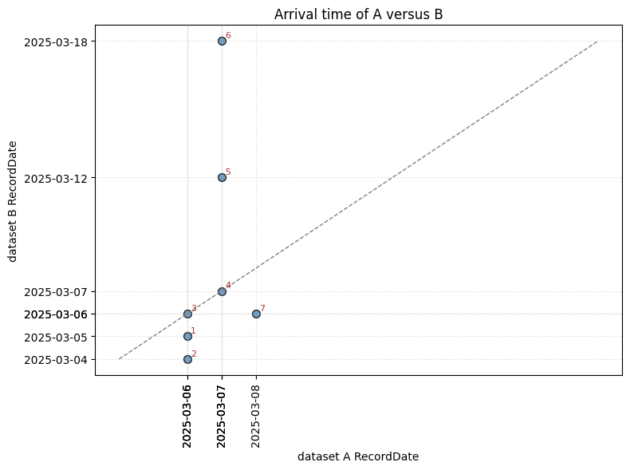

# Dependencies 
- Python
- PySpark

# Summary

This library implements an incremental join function to join 2 (usually large) incrementally refreshed tables, taking into account the refresh timestamp of each table and the fact that data might arrive late. 

For a detailed description of how this join works, please continue reading. 

- [Dependencies](#dependencies)
- [Summary](#summary)
- [Incremental refresh](#incremental-refresh)
- [Incremental join](#incremental-join)
- [Example](#example)
  - [A](#a)
  - [B](#b)
  - [Arrival time of A versus B](#arrival-time-of-a-versus-b)
    - [Observations:](#observations)
  - [Sliding join window](#sliding-join-window)
    - [Look back interval](#look-back-interval)
    - [Waiting interval](#waiting-interval)
    - [Timed out records](#timed-out-records)
    - [Output window](#output-window)
- [Implementation](#implementation)
  - [Join scenarios](#join-scenarios)
    - [On time](#on-time)
    - [A is late](#a-is-late)
    - [B is late](#b-is-late)
    - [Incremental join of A and B is outdated](#incremental-join-of-a-and-b-is-outdated)
  - [Implementation using SQL](#implementation-using-sql)
  - [Target increment timestamp](#target-increment-timestamp)
- [Conclusion](#conclusion)
- [Installation](#installation)
- [Usage](#usage)
- [Contributing](#contributing)
- [License](#license)
- [Future research](#future-research)

# Incremental refresh

Suppose you have two big datasets that are incrementally refreshed. This means that every day we add or change only the new data and mark this with a unique timestamp. Using this timestamp, downstream applications can pick up these changes and there is no need for an expensive full table refresh. 

# Incremental join

After loading the data, we want to join the two datasets. This join can become quite complex, because you will have to take into account that data might arrive late, or not at all. There is a tradeoff between completeness and performance here. When tables are small, we usually include all data in the join, this makes our code simple, but also slower. For big data tables this is not an option. 

**Requirements of incremental join function:**
- Performance: Filter A and B into the smallest subsets possible before joining. 
- Consistency: The outcome of the join is not dependent on the size of the join interval (e.g. daily, monthly, yearly). This is often a requirement when using the data for machine learning and you don't want to be troubled by changing historic data.  

Moving the join logic to a dedicated function implements the following requirements:
- Efficiency: Users do not have to worry about the complexity of incremental join. 
- Maintainability: The complexity of incremental join is removed from your code and thus it makes your code more readable and easier to maintain.  
- Code quality: Prevent user mistakes in the complex joining conditions of incremental join by externalizing and parameterizing this code. 

# Example

To explain the implementation of incremental joining we introduce the following example datasets:

- A: Bank Transactions from the financial system  
- B: Bank Transactions from the SEPA payment engine.

Note that both tables are huge (multiple terabytes).

Let's introduce some example data:
## A
| TrxDT               | CreditDebit | AmountEuro   | AccountName    | TrxId | RecordDate<sup>[1](#fn1)</sup> |
| ------------------- | ----------- | ------------ | -------------- | ----- | ---------- |
| 2025-03-06 20:45:19 | Credit      | 700.3000000  | Madame Zsa Zsa | 1     | 2025-03-06 |
| 2025-03-06 12:22:01 | Debit       | 200.0000000  | Madame Zsa Zsa | 2     | 2025-03-06 |
| 2025-03-06 20:59:00 | Debit       | 1110.2000000 | Madame Zsa Zsa | 3     | 2025-03-06 |
| 2025-03-06 23:50:00 | Credit      | 50.0000000   | Madame Zsa Zsa | 4     | 2025-03-07 |
| 2025-03-06 08:00:00 | Credit      | 1500.0000000 | Mr. X          | 5     | 2025-03-07 |
| 2025-03-07 14:45:00 | Debit       | 300.2500000  | Mr. X          | 6     | 2025-03-07 |
| 2025-03-10 09:00:00 | Credit      | 99.9900000   | Mr. X          | 7     | 2025-03-08 |
<sub>1. <a name="fn1"></a>RecordDate represents the moment at which the record was stored in this dataset. For simplicity we use dates instead of timestamps</sub>

## B
| TrxId | CountryCode | RecordDate |
| ----- | ----------- | ---------- |
| 1     | NL          | 2025-03-05 |
| 2     | NL          | 2025-03-04 |
| 3     | NL          | 2025-03-06 |
| 4     | UK          | 2025-03-07 |
| 5     | NL          | 2025-03-12 |
| 6     | NL          | 2025-03-18 |
| 7     | DE          | 2025-03-06 |

## Arrival time of A versus B
The following chart shows the arrival time of A versus the arrival time of B. Arrival time a synonym of RecordDate.   



### Observations:

We will abbreviate a transaction as Trx. 

- There are 7 transactions, each with a unique TrxId
- Trx 3 and 4 arrive on the same day in dataset A and B.
- Trx 1,2 and 7 have already arrived in B at the time they arrive in A ( we say that A is late).
- Trx 5 and 6 arrive late in B ( B is late).    

Let's quantify how late B is with respect to A.
| TrxId | RecordDate_A | RecordDate_B | DiffDays |
| ----- | ------------ | ------------ | -------- |
| 1     | 2025-03-06   | 2025-03-05   | -1        |
| 2     | 2025-03-06   | 2025-03-04   | -2        |
| 3     | 2025-03-06   | 2025-03-06   | 0        |
| 4     | 2025-03-07   | 2025-03-07   | 0        |
| 5     | 2025-03-07   | 2025-03-12   | 5       |
| 6     | 2025-03-07   | 2025-03-18   | 11      |
| 7     | 2025-03-08   | 2025-03-06   | -2        |

## Sliding join window

The sliding join window defines how we filter B when incrementally joining A with B. The sliding join window is defined with repect to dataset A. 
This example shows that we need to look back at most 2 days and wait 11 days in order to always find a match in B. 

`JoinWindow(a) = a.RecordDate - look_back_interval till a.RecordDate + waiting_interval`

We define the SlidingJoinWindow on A and then apply it on B (by setting the filter to match this window). 
Note that this window is a sliding window with respect to the RecordDate of A. 

### Look back interval
How many days should we include in our filter to look back in arrival time of B ? Setting look back too high has negative impact on performance. Setting it too low will result in mismatches in the join. 

### Waiting interval
how many days should we wait for the arrival of B. Setting the waiting interval too high results in high latencies in the delivery of the data to the consumer. Setting it too low will result in mismatches in the join. 

Ideally look back and waiting intervals are defined on max deltas in the historic data, potentially incremented with some bandwith for future scenario's.  


### Timed out records

The waiting interval defines how long we should wait for a matching record in B. When a match is not found after this interval, we call the record timed out. Waiting means that the incremental join will not output the record during this waiting interval. At the moment it is timed out, the record will be send to the output having a timed out status. 

For example, if we would take a waiting interval smaller than 11 then Trx 6 would be timed out at A.RecordDate + wait interval. E.g. When wait interval would be 10, Trx 6. would be timed out at 2025-03-17.

### Output window

The output window defines the interval for which we want to generate the output of the incremental join. Typical values are: 
- daily
- monthly 
- yearly  
- all 
  
But you are free to choose any custom output window as well.  
The output window is not a moving window. It does not slide with the value of RecordDate. 

For example: we want to have the output of the inc_join for 2025-03-07 (daily), or 2025-03 (monthly). 

# Implementation

Our implementation builds a sql query that makes use of the **sliding join window** and **output window** and combines 4 join scenario's:

## Join scenarios

### On time

A and B arrived both within the output window. 

- `A.RecordDT is contained in the output window` 
- `B.RecordDT is contained in the output window` 
- if `enfore_sliding_join_window` then 
  - `B.RecordDT is contained in the sliding join window of df_a(RecordDT)`
- `Output.RecordDT = max(df_a.RecordDT, df_b.RecordDT)`

### A is late

A arrived later than B. 

- `A.RecordDT is contained in the output window` 
- `B.RecordDT is contained in the output window extended with -look_back_time` 
- if `enfore_sliding_join_window` then 
  - `B.RecordDT is contained in the sliding join window of df_a(RecordDT)`
- `Output.RecordDT = df_a.RecordDT`

### B is late

B arrived later than A. 

We cannot extend the filter on output window to the future, because the output window can be set to the latest available increment. Assumption: if there is a previous increment, then it is loaded, or in other words: the data is loaded historically in a sequential order. So we can always extend our filter to the past. 


- `B.RecordDT is contained in the output window` 
- `A.RecordDT is contained in the output window extended with waiting_time` 
- if `enfore_sliding_join_window` then 
  - `B.RecordDT is contained in the sliding join window of df_a(RecordDT)`
- `Output.RecordDT = df_a.RecordDT`


### Incremental join of A and B is outdated

After the lookback and lookforward we still cannot match A and B. For example: if we still did not find a match on March 16, then we send A unmatched to the output (because A was received on March 6 and the wait period is 10 days).

## Implementation using SQL

```sql
-- A LEFT JOIN B where:
(
  -- same day
  (
    A._ProcessDate >= ProcessPeriodStart
    AND A._ProcessDate <= ProcessPeriodEnd
  )
  AND
  ( A._ProcessDate = B._ProcessDate )
)
OR
(
  -- A is late (for max look_back_days days) or same day
  (
    A._ProcessDate >= ProcessPeriodStart
    AND A._ProcessDate <= ProcessPeriodEnd
  )
  AND
  (
    B._ProcessDate >= date_add(A._ProcessDate, -look_back_days)
    AND B._ProcessDate < A._ProcessDate
  )
)
OR
(
  -- B is late
  (
    B._ProcessDate >= ProcessPeriodStart
    AND B._ProcessDate <= ProcessPeriodEnd
  )
  AND
  (
    A._ProcessDate >= date_add(B._ProcessDate, -look_forward_days)
    AND A._ProcessDate < B._ProcessDate
  )
)
OR
(
  -- A is outdated (unable to match with B)
  A._ProcessDate >= ProcessPeriodStart - look_forward_days
  AND A._ProcessDate <= ProcessPeriodEnd - look_forward_days
  AND B._ProcessDate IS NULL -- no match in all period
)
```

## Target increment timestamp

Note that we identify each increment with a unique and sequential timestamp. When we join A with B we should define the target timestamp for the joined data.

**Target timestamp for A incremental join B:** Max timestamp from A and B or outdated timestamp.

# Conclusion

We described a way of joining very large incrementally refreshed tables, focused on performance and consistency. We moved this logic into a Python function in Databricks. The big advantage is that you remove complexity from your code, so your code becomes more readable. It will only contain the things that are specific for the datasets that you are joining, e.g. join condition, look back and wait intervals and aliases for the datasets so that you will not get duplicated columns.

# Installation

To install My Python Library, you can use pip:

```
pip install my-python-library
```

# Usage

Here is a simple example of how to use My Python Library:

```python
from my_python_library import some_function

result = some_function()
print(result)
```

# Contributing

Contributions are welcome! Please read the [CONTRIBUTING.md](CONTRIBUTING.md) for guidelines on how to contribute to this project.

# License

This project is licensed under the GNU Lesser General Public License v3 or later (LGPLv3+) License - see the [LICENSE](LICENSE) file for details.

# Future research

- The reason that we have to be carefull with the size of the join window is that spark will select all needed columns of A and B for this join window. This has a huge performance impact. However if we would take a two step approach where we first retrieve the RecordDate for a given foreign key and use that in our join, this would make the second step faster and makes the look back interval of the join window obsolete. We would still have to wait in this case.  
- When doing an inner join or left join, spark should be able to leverage the indexing of the foreign key (e.g. Z-Order or liquid cluster) in order to make an efficient query plan that does only retrieve relevant records. Our experience shows that this is currently not implemented that way. The query plan is quite simple: read A and B completely and then do the join. 
